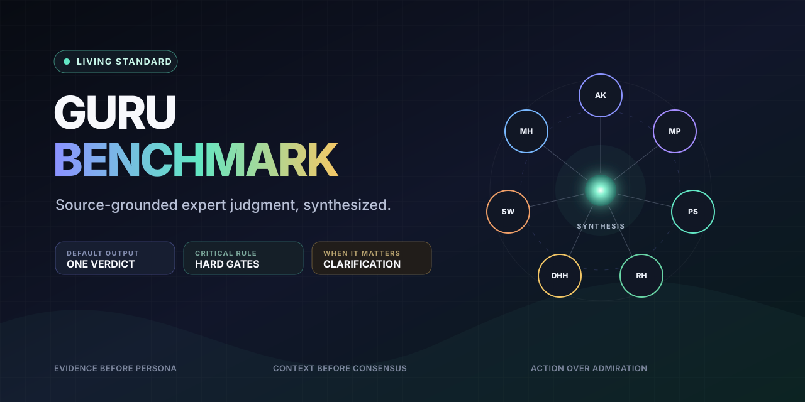

<p align="center">
  
</p>

# Guru Benchmark

[](#validate)
[](LICENSE)
[](CHANGELOG.md)

**A living, source-grounded expert council for repeatable technical judgment.**

Guru Benchmark turns dated public evidence about influential builders into one context-weighted technical verdict. It does not impersonate experts, invent quotations, or average away critical failures.

## What it will produce

```text
Guru Verdict       One recommended direction
Guru Score         Weighted score with hard-gate effects
Current Score      Evidence-backed state today
North Star Score   Conditional quality of the proposed ideal
Ultimate Design    The strongest context-fit synthesis
Clarification      Material disagreement and trade-offs
Next Moves         Ordered, testable actions and explicit non-actions
```

The founding council contains Andrew/Andrej Karpathy, Matt Pocock, Peter Steinberger, Rich Hickey, David Heinemeier Hansson, Simon Willison, and Mitchell Hashimoto. Everyone remains visible; relevance, evidence, confidence, and abstention determine influence.

## Why this repository exists

A question such as _“How would these experts design this?”_ usually produces celebrity fanfiction or seven unrelated essays. Guru Benchmark instead defines a reproducible system:

1. classify the decision context;
2. select immutable, source-grounded lens snapshots;
3. apply domain relevance and evidence confidence;
4. run hard gates before scoring;
5. calculate a weighted-median synthesis;
6. explain disagreement only when it can change the decision;
7. return concrete next moves.

## Repository status

The repository foundation is complete. Product behavior is intentionally represented as a dependency-ordered Go backlog rather than pretend implementation. The current artifacts define and validate:

- the [product vision](docs/product-vision.md);
- the machine-readable [design contract](docs/vision.json);
- the [system architecture](docs/architecture.md);
- the [benchmark model](docs/benchmark-model.md);
- the initial [`guru-ai-engineer@2026.09`](benchmarks/guru-ai-engineer/2026.09.json) contract;
- the [implementation plan](docs/implementation-plan.md);
- public-safety and repository gates.

## Get started

Requirements: Git, Bash, Make, Python 3.11+, and network access on the first Go workflow bootstrap.

```bash
git clone https://github.com/viggomeesters/guru-benchmark.git
cd guru-benchmark
./go doctor . --platform auto --agent auto
make check
./go status . --json
```

See [Getting Started](docs/getting-started.md) for the repository map and contributor workflow.

## Validate

```bash
make check
```

The gate runs contract tests, JSON Schema validation, repo-local Go validation, architecture validation, documentation checks, and a tracked-file public-safety audit.

## Start the next task

```bash
./go status . --json
./go claim <TASK-ID> --repo . --agent <your-agent>
```

Read [`AGENTS.md`](AGENTS.md) before editing. Repository files and `.go` state are authoritative.

## Public safety and non-affiliation

Guru Benchmark is an independent open-source project. It is not affiliated with, approved by, or endorsed by any council member. Expert lenses must cite dated public sources, distinguish direct evidence from inference, and abstain when support is insufficient. Never commit source corpora, private user context, credentials, generated evaluations, or local caches.

## Contributing and security

- [Contributing](CONTRIBUTING.md)
- [Security policy](SECURITY.md)
- [Code of conduct](CODE_OF_CONDUCT.md)
- [Governance and updates](docs/governance.md)
- [Changelog](CHANGELOG.md)

## License

[MIT](LICENSE). Source materials referenced by future lens metadata retain their original rights and are not relicensed by this repository.
